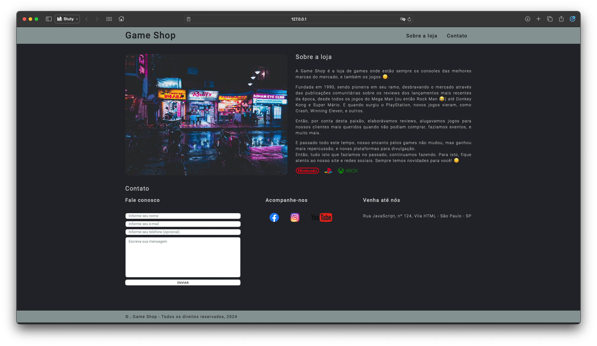

# EBAC Profissão: Engenheiro Front-End - v2

<div>
     <p style="text-align: center">🚧 ♻︎ ❗️Em construção ❗️ ♻︎ 🚧</p>
     <p style="text-align: center">🚨 🚃 🚦 🚀 🛰️ 🌋 🌇 🖥️ 🖨️ 📺  👾 👽 🖖🏻 ☔️ 💺</p>
</div>

Este projeto está sendo desenvolvido durante o curos de formação "Engenheiro Front-End" oferecido pela EBAC (Escola Britânica de Artes e Comunicação).

Cada módulo do curso foi inserido em um subdiretório, sendo acessível através do index.html. Abaixo, será descrito o objetivo de cada módulo, seu desenvolvimento, e resultados estregues.

## Módulo 00 -

## Módulo 01 -

## Módulo 02 - Versionamento GIT

Neste módulo, foi visto o conteúdo sobre o processo de versionamento dos arquivos de um projeto, de qualquer natureza, a partir da ferramenta GIT, e que está sendo armazenado neste repositório através do GitHUb. 🙂

O intuito do mesmo seria introduzir este conceito para quem nunca teve seu conhecimento, e/ou, prática, bem como, aplicar os conteidos básicos sobre o processo de:
+ Inicializar um repositório;
+ Criar configurações globais e locais;
+ Vincular um repositório on-line;
+ Criar Branchs;
+ Criar commits;
+ E publicar estas atualizações no GitHub.

Apenas como forma de demonstração, a tarefa proposta neste módulo está armazenada NESTE LINK, e aproveitei a oportunidade para descrever um pouco sobre o GIT e seus principais comandos utilizados.


## Módulo 03 - HyperText Markup Language (HTML)

### Resultado final

## Módulo 04 - Cascading Style Sheets (CSS)

### Resultado final

## Módulo 05 - Projeto 01 - Game Shop

Neste projeto será criado uma página HTML, estilizada para simular um website de uma loja de games, _"Game Shop"_, apenas para conter uma aplicação do conhecimento proposto pelo curso, em uma estruturação de `<section>`, `<div>` e `<form>`, e os conhecimentos de estruturação dos elementos HTML e sua estilização por meio do CSS.

Seguindo o padrão presente neste projeto, a identificação das classes seguirá o processo de hierarquia conforme suas filiações nos elementos HTML, e também, no CSS, e esta mesma identificação, bem como, a criação de arquivos separados, para gerar:

-    Um padrão (default) presente em todo o documento
-    Um arquivo para cada `<section>`, gerando assim uma melhor organização e identificação do que será modificado no projeto

Abaixo, alguns pontos interessantes aplicados neste projeto.

### `border-sizing`

A propriedade `border-sizing` com o valor `border-box` é útil para determinar de que o conteúdo do elemento ficará restrito ao seu próprio container. Desta forma, seu dimensionamento, quando ocorrer a inserção de margins, bordas e padding serão distribuídos de maneira igualitária dentro das delimitações do elemento. Por exemplo:

-    Um elemento com `height: 50px` e `width: 100px`
-    Ao inserir padding e bordar ao elemento, os valores não serão somados aos números anteriores, mas, delimitados neste tamanho máximo

### `max-width`

Um conceito muito interessante implementado seria determinar o tamanho máximo que a `<section>` poderá ocupar, através da propriedade `max-width`. Neste processo, está sendo determinado por exemplo, que o conteúdo da página ficará restiro a um tamanho HD, em pixels, 1366px, e que o container da seção irá ocupar sempre 100% do seu espaçamento máximo permitido.

Assim, fica determinado um espaço fixo para o elemento, e quando a página for acessada por monitores maiores que o tamanho definido, haverá sempre a centralização do conteúdo.

Exemplo:

```css
section {
     margin: auto;
     max-width: 1366px;
     width: 100%;
}
```

Demonstração:

<!--  -->


### Resultado final

<!--  -->


## Módulo 06
